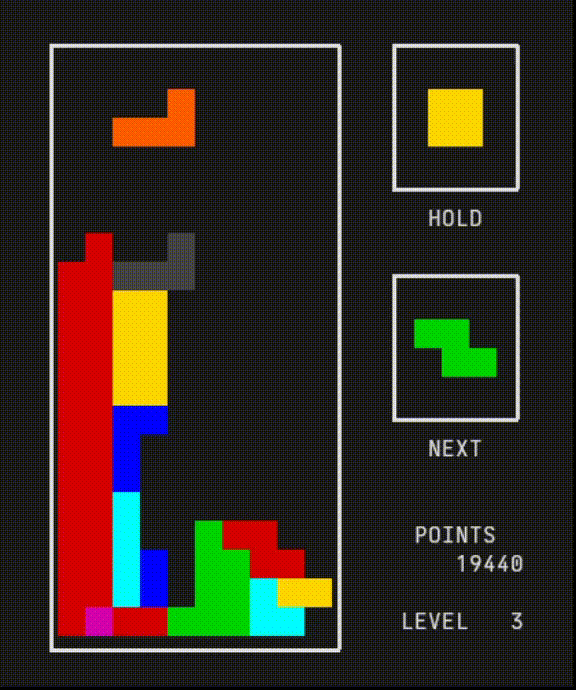

## Tetric

Tetric is a Tetris clone, written in C, to play on the terminal. Made without
ncurses.

Note: requires UTF-8 compatible terminal emulator; works best if the characters
are exactly twice as tall as they are wide. Also, play on a terminal at least
24 rows tall and 41 columns wide.

No keypress storage, hence no real fancy rotation system. Gameplay is similar
to NES Tetris'. Soft drop is instantaneous too, the only difference to hard
drop is that it doesn't lock the piece in place automatically.

### Controls:
- a turn left
- d turn right
- s turn 180
- ← move left
- → move right
- ↓ soft drop
- ␣ hard drop
- ! quit

### Sources:
- https://harddrop.com/wiki/Tetris_Wiki
- https://en.wikipedia.org/wiki/ANSI_escape_code
- https://www.w3.org/TR/xml-entity-names/025.html
